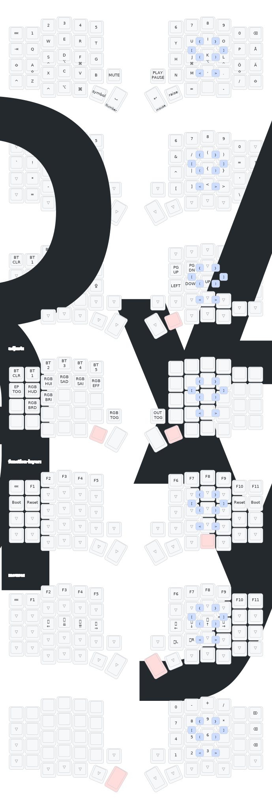

# My Sofle Keyboard Build and Firmware

My personal configuration of my Sofle build that I modify to be more productive in development and writing.

## Introduction

This repository is dedicated to my Sofle split keyboard build, featuring a fully customizable and 3D-printed case, wireless connectivity, and a personal twist on the firmware.

Make sure to read through the guide thoroughly before starting your build.

## Features

- Timeless homerow mods (Idea from [urob][https:www.github.com/urob/zmk-config])
- Combos with symbols (Idea from [urob][https:www.github.com/urob/zmk-config])
- Swedish Character for mac mapped with Zmk Locale Generator and cldr found on github.

## Future Improvements

- **Battery Life Optimization:**\* Testing and optimizing battery life with different power-saving modes.\*
- **Case Design Variants:**\* Plan to create a low-profile variant of the case.\*
- Will add specific Vim Layer for productivity
- Modularize the configuration to make it more maintainable and easier to customize.

## Keymap Overview

## Contributing

Feel free to contribute by suggesting improvements, creating issues, or submitting pull requests. I'd love to hear your thoughts or see your own builds!

## License

This project is licensed under the MIT License. See the [LICENSE](LICENSE) file for more details.
