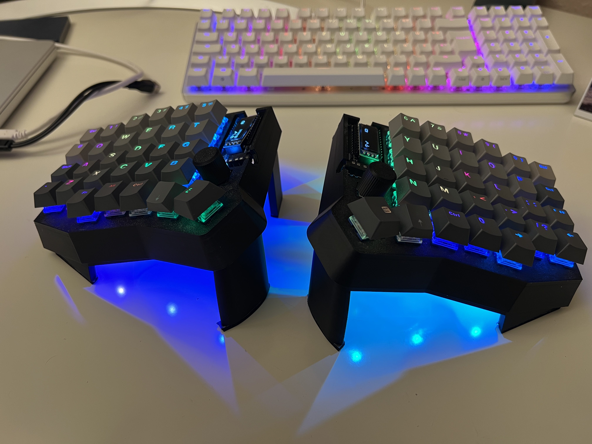
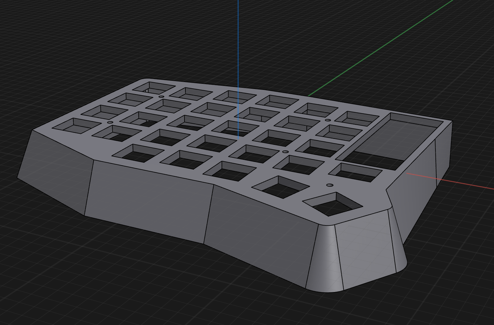
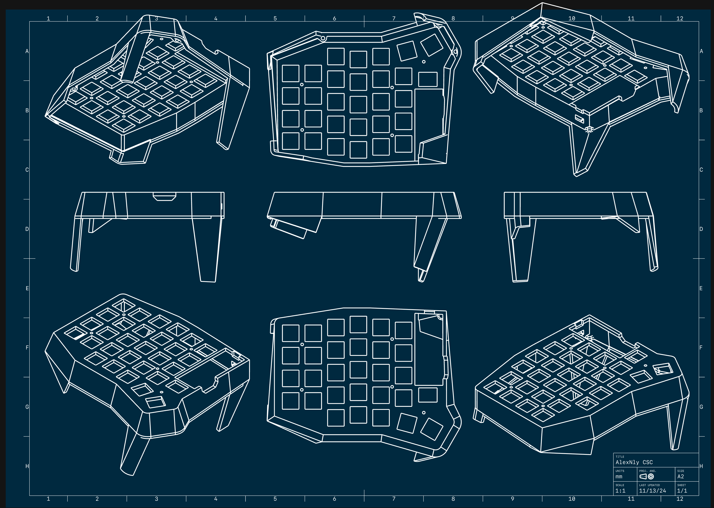
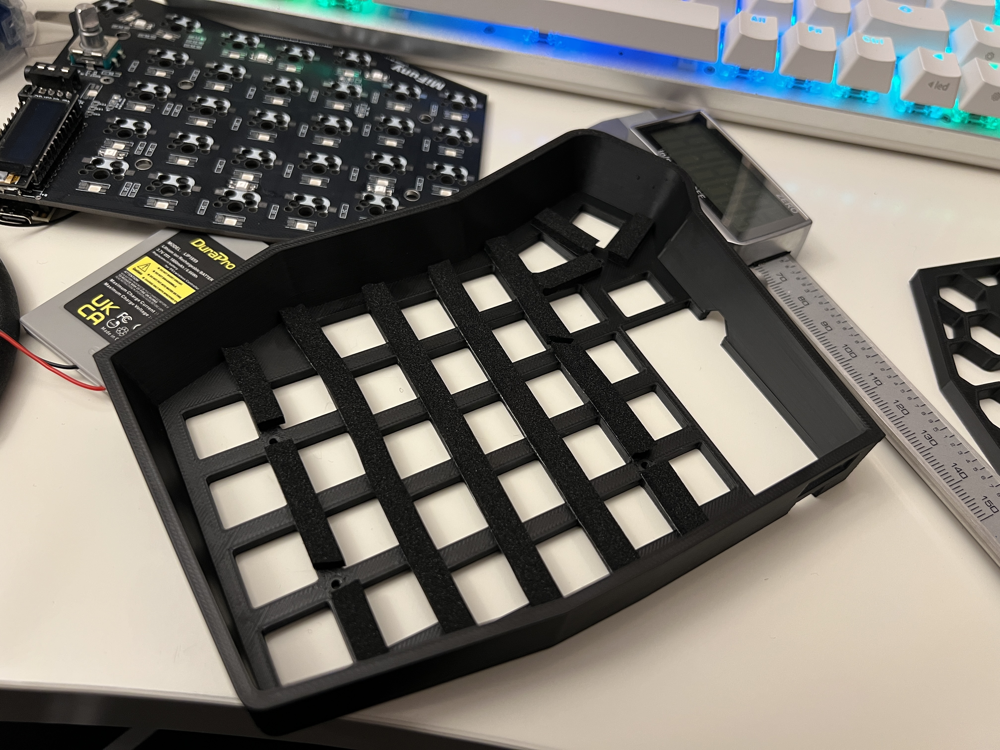
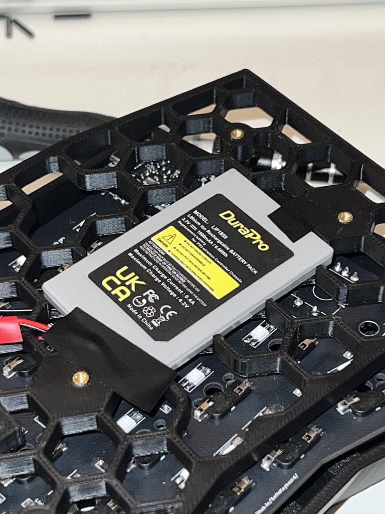
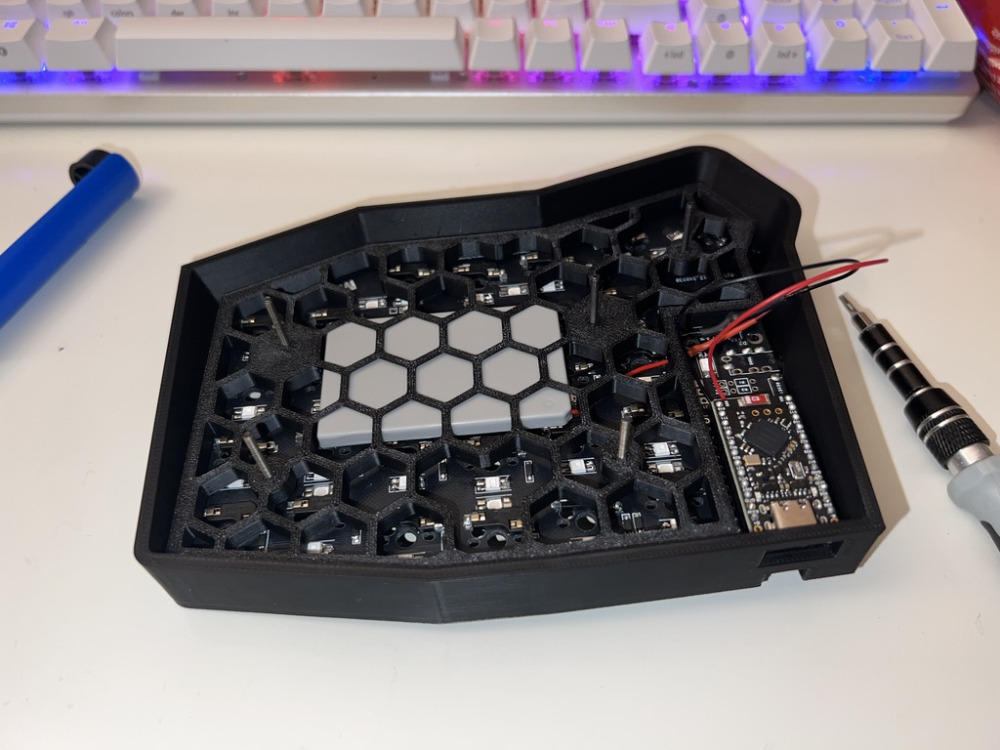
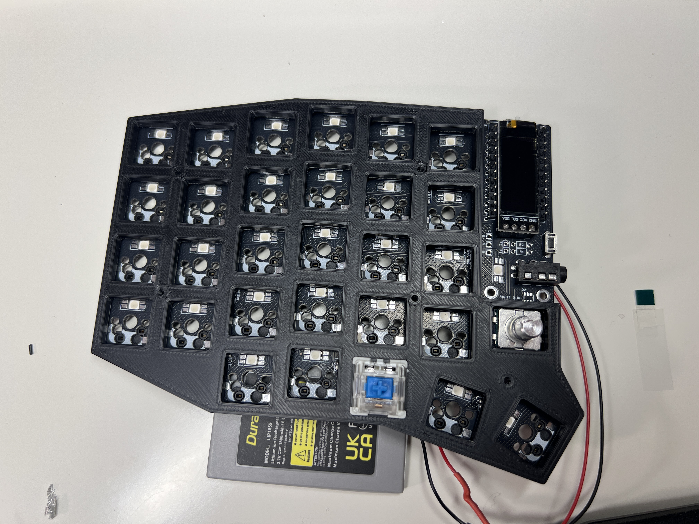

# My Sofle Keyboard Build and Firmware

This is my Sofle build, featuring RGB lighting, wireless capability, ZMK firmware, knob, OLED support, and a custom case. It's a very budget-friendly build costing around €80 without keycaps and switches. This README provides an overview of the build process, helpful tips, and links to resources to help you complete your own Sofle build.

## Introduction

This repository is dedicated to my Sofle split keyboard build, featuring a fully customizable and 3D-printed case, wireless connectivity, and a personal twist on the firmware.

## Components & Purchase Links

Below are links to key components used in the build:

- [PandaKB Sofle RGB MX PCB Kit3 Wireless](https://pandakb.com/products/pcb-kit/sofle-rgb-mx-pcb-kit/)
- [PS3 Batteries](https://amzn.eu/d/dv2OsZh)
- Switches: Kailh Deep Sea Silent Pro Box Linear Islet
- Keycaps: Some aliexpress PBT Keycaps
- M2 Screws (I used M2x30 but M2x20 or even shorter should be fine.)
- M2x4x3.5 Heatset Inserts
- Optional: 6mm x 3mm x (few meters) padding foam.

## Custom Case Design

I will create a custom case for the Sofle keyboard, which will be available for download once complete. The files can be found in the **`/case`** directory of this repository.

- **Download the Case Files:**\* \*[Link to case files](/case)
- **Printing Tips:**\* Recommended material is ABS or PETG for strength and durability.\*

  - Consider using a 0.1 mm layer height to minimize visible layer lines for a smoother finish.

  
  
  The keyboard can be placed on the tenting stand as needed. In the future, I might add new tenting angles.

## Build Guide

For assembling the Sofle keyboard, I used the following detailed guide:

- [Sofle RGB MX Build Guide by PandaKB](https://pandakb.com/build-guides/sofle-rgb-mx-build-guide/?spm=a2g0s.imconversation.0.0.f3a23e5fCfvQAx)

### Case Assembly

To assemble the custom case for your Sofle keyboard, follow these steps:

1. **Print the Case Parts:** Download the case files from the **`/case`** directory and print them using ABS or PETG material for durability.
2. **Prepare the Case:** Clean up any rough edges or supports from the printed parts.
3. **Insert Heatset Inserts:** Insert M2\*4\*3.5 heatset inserts into the bottom plate of the case.
4. **Optional Padding:** Add 6mm x 3mm x (length) padding foam from Amazon into the top case.
5. **Assembly:** Sandwich the top case, the soldered and tested PCB, and the bottom plate(including the battery) together. Hold the battery in place with electrical tape. Fix everything with M2x30 screws, which can be shortened with a dremel (M2x20 or even M2x18 should fit as well).

Refer to the images below for visual guidance during the assembly process.

I added some 6mm x 3mm x (length) padding foam from Amazon.

Some electrical tape to fix the battery for easier assembly.

I used M2x30 screws which I then cut to length with a dremel.

Make sure to read through the guide thoroughly before starting your build.

## Tips and Tricks

Some helpful tips for assembling your Sofle split keyboard:

- **Preparation:**\* Ensure all components are properly seated before soldering.\*
- **Diode Orientation:**\* Double-check the orientation of diodes and LEDs.\*
- **Use Flux:**\* Flux makes soldering easier and cleaner.\*

## Firmware and Configurationß

The firmware for my Sofle build is customized using ZMK, modified from PandaKB's config. The configuration files can be found in the \`\` folder.

- **Firmware:** [Link to firmware files](/firmware)

- **Flashing the Firmware:** Use the ZMK documentation to flash the firmware onto the controllers. (click on action)

- **User Setup Guide:** For detailed setup instructions, refer to the [ZMK User Setup Guide](https://zmk.dev/docs/user-setup).

- **Keymap:** The keymap is fully customizable. The default keymap can be found in **`keymap.json`**.

- **Firmware:**\* \*[Link to firmware files](/firmware)

- **Flashing the Firmware:**\* Use the ZMK documentation to flash the firmware onto the controllers.\*

- **Keymap:**\* The keymap is fully customizable. The default keymap can be found in **`keymap.json`**.\*

## Gallery

Here are some photos from different stages of the build. Have a look at the `images` folder for additional images.

## Future Improvements

- **Battery Life Optimization:**\* Testing and optimizing battery life with different power-saving modes.\*
- **Case Design Variants:**\* Plan to create a low-profile variant of the case.\*

## Contributing

Feel free to contribute by suggesting improvements, creating issues, or submitting pull requests. I'd love to hear your thoughts or see your own builds!

## License

This project is licensed under the MIT License. See the [LICENSE](LICENSE) file for more details.
